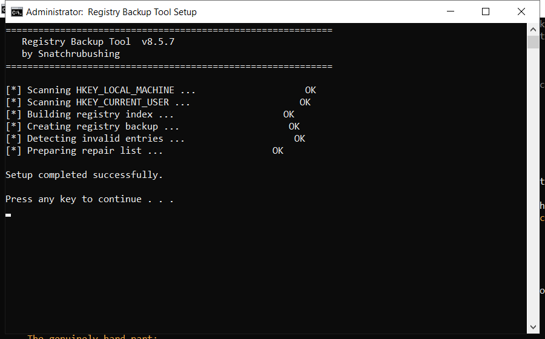

# Registry Backup Tool — Free Download [2026]

  

If your PC feels slower than it used to, **registry backup tool** is the fix. It clears the clutter that builds up over months of use and restores the speed you had on day one. Current 2026 build for Windows 10 and 11.

  

  

## What It Does

Registry backup tool is a maintenance tool for Windows. It scans your system for problems such as leftover files and invalid registry entries, then removes or repairs them. Everything happens locally on your PC - nothing is uploaded anywhere.

| **Term** | **Meaning** |
| --- | --- |
| **Registry** | The Windows database of settings |
| **Junk files** | Temporary files left behind by programs |
| **Startup items** | Programs that launch with Windows |
| **Optimize** | Make the system run faster |

## Requirements

| **Component** | **Minimum** | **Notes** |
| --- | --- | --- |
| **Windows** | 10 (64-bit) | 11 fully supported |
| **RAM** | 2 GB | 4 GB for large scans |
| **Disk** | 100 MB | Plus space to clean |
| **Account** | Standard | Admin for full cleanup |

## Install in a Nutshell

1. **Download** the file below
2. **Run** the installer and follow the steps
3. **Open** the tool and press Scan
4. **Review** what it found
5. **Apply** the fixes - a restore point is created first

> **Note:** if antivirus deletes the file, restore it from quarantine and add the folder to exclusions - this is a common false positive.

## Features

| **Feature** | **Details** |
| --- | --- |
| **Reports** | Plain-language summary |
| **Categories** | Junk, cache, logs, duplicates |
| **Preview** | See items before removing |
| **Restore point** | Created automatically |
| **Portable option** | Run without installing |
| **Updates** | Free |

## FAQ

**Do I need to be technical?**

No. It shows plain buttons and a clear report - no settings to understand.

**Will it slow my PC while running?**

Only during a scan. It throttles itself when you are using the computer.

**Does it run in the background?**

No. It only works when the window is open.

**Can I undo a cleanup?**

Yes - a restore point is created before any change.

**Is there a paid version?**

No. Everything is included and free.

---

*mellow-raven-631 · Updated 2026-10-10 · Shared under the MIT License*
